# Guía Paso a Paso: Creación de un Microservicio Base en Spring Boot
Esta guía servirá de base para el desarrollo del Trabajo Práctico Nro. 1 de la materia y tiene como objetivo brindar los lineamientos necesarios para la construcción de un microservicio básico en Spring Boot. El contenido presentado en este documento contempla la primera etapa del proyecto; la completitud del archivo README.md junto con el código correspondiente deberá ser finalizada y entregada a través del repositorio asignado con fecha límite el 2 de Octubre de 2026. En el ejemplo se trabaja con el IDE IntelliJ IDEA Community, pero el proyecto funcionará también en cualquier otro IDE compatible.

# 1. Configuración del Proyecto en Spring Initializr
Para dar inicio al desarrollo, ingrese al sitio web start.spring.io y configure los datos del formulario de la siguiente manera:

**Project:** Maven

**Language:** Java

**Spring Boot:** Seleccionar una versión estable 4.1.1 (o superior de acuerdo a la fecha de lectura de esta guía)

**Group:** com.distribuido

**Artifact:** Auto

**Packaging:** Jar

**Java:** 17 (o la versión correspondiente al entorno de trabajo configurado)

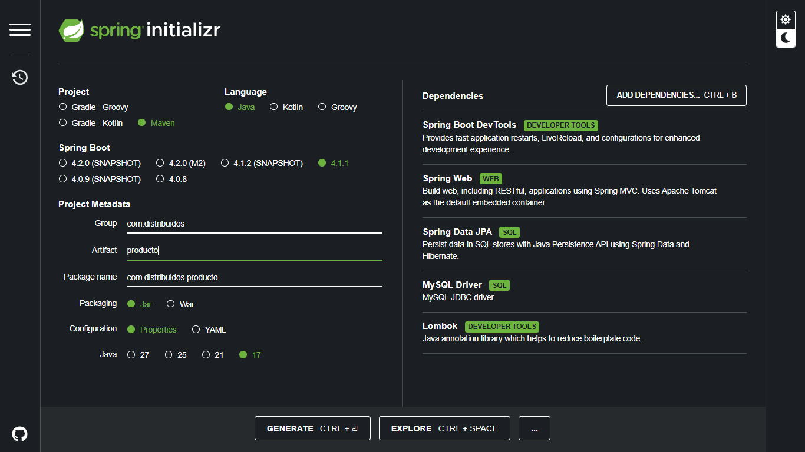

### Dependencias requeridas: 
En el panel lateral derecho, proceda a seleccionar las siguientes 5 dependencias:   
+ Spring Boot DevTools: Proporciona reinicios automáticos de la aplicación y recarga en vivo para acelerar el proceso de desarrollo.   
+ Spring Web: Permite la construcción de aplicaciones web y la exposición de servicios RESTful utilizando Spring MVC.   
+ Spring Data JPA: Facilita la persistencia de datos en bases de datos relacionales mediante la API de Java Persistence y Hibernate.   
+ MySQL Driver: Controlador JDBC indispensable para conectar la aplicación con el motor de base de datos MySQL.   
+ Lombok: Librería de herramientas para desarrolladores que ayuda a reducir el código repetitivo (boilerplate code), generando automáticamente getters, setters, constructores y más mediante anotaciones.   

Posteriormente, haga clic en GENERATE, descargue el archivo comprimido .zip y proceda a descomprimirlo en su equipo.

# 2. Importación y Apertura en IntelliJ IDEA
Inicie la aplicación IntelliJ IDEA, NetBeans o la que usted utilice para trabajar en mi caso es Sprint toots.

Seleccione la opción File > Open... y navegue hasta el directorio donde descomprimió el proyecto (Auto).

Aguarde unos momentos mientras el gestor de dependencias Maven efectúa la descarga e indexación del proyecto.

Verifique que la estructura del directorio mantenga la siguiente forma:

``` Plaintext
src/
└── main/
    └── java/
        └── com/
            └── distribuido/
                └──Autos /
                    └── AutosApplication.java
```
# 3. Creación de la Estructura de Paquetes
Con la finalidad de respetar estrictamente la arquitectura en capas (Controller → Service → Repository → DB), es necesario crear 4 paquetes dentro de la ruta principal com.distribuido.Autos:

Haga clic derecho sobre el paquete base ***com.distribuido.Autos***.

Diríjase a ***New > Package***.

Incorpore cada uno de los siguientes paquetes:

+ com.distribuido.Autos.controller

+ com.distribuido.Autos.model

+ com.distribuido.Autos.repository

+ com.distribuido.Autos.service

La jerarquía dentro del proyecto deberá visualizarse de la siguiente manera:

```Plaintext
com.distribuido.Autos/
├── controller/
├── model/
├── repository/
├── service/
└── AutosApplication.java
```

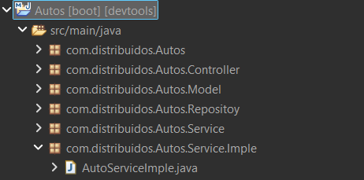

# 4. Creación de la Entidad Auto.java
Vamos a empezar con el modelado de **Auto**, la clase Auto.java debe estar en el paquete Model.
Dentro del paquete model, se procederá a definir la clase de dominio que representará la tabla dentro de la base de datos. En este caso dado que se trata del primer microservicio que estamos haciendo utilizaremos únicamente tipos de datos elementales para facilitar la comprensión.

Seleccione ***New > Java Class*** e ingrese el nombre **Auto**.

---
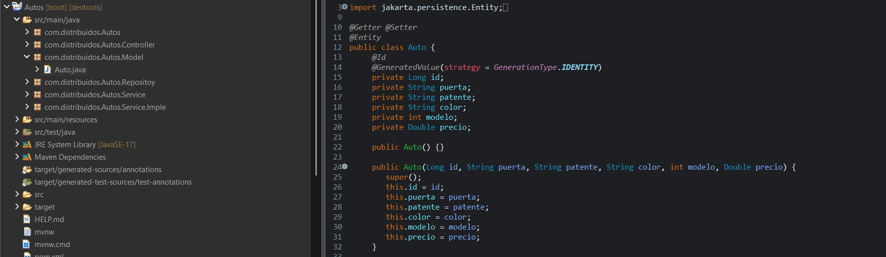

### Explicacion:
+ principalmente es agregar @Entity ala clase
+ despues @Id y @ @GeneratedValue(strategy = GenerationType.IDENTITY) para que genere el id de forma automatica.
+ a continuacion los diferentes atributo que tendra la clase
**private String puerta;**
+ avece lo puede tomar lo **getter y setter** sin ponerlo por Dependecia LOMBOK,pero en mi caso lo tuve que poner a mano.
---

# 5. Creación de la interface de Repository

### Explicacion:
+ Dentro del paquete de repositorios, debemos crear una interfaz que se encargará de gestionar las operaciones con la base de datos.
+ Como se observa en la imagen, tenemos que dijirigirnos al paquete **com.distribuidos.Autos.Repositoy** y creamos un nuevo archivo interface llamado **IAutoRepository.java**. 
  
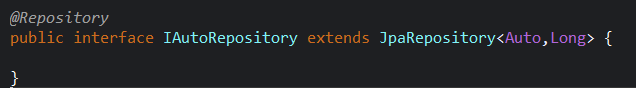

+ **@Repository**: Esta anotación se coloca sobre la declaración para indicar a Spring que este componente es el encargado de interactuar con la base de datos.
+ **extends JpaRepository<Auto, Long>**: La interfaz hereda de JpaRepository para obtener todas las operaciones(metodos) básicas sobre la base de datos sin necesidad de escribirlas manualmente.
+ Los parámetros **<Auto, Long>** indican que este repositorio gestionará específicamente la entidad Auto, y que el tipo de dato de su identificador principal (@Id) es un objeto de tipo Long.
---


# 6,7. Interfaz y implementacion del service
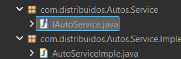

### Interface:
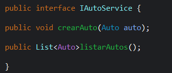
+ Esta interfaz actúa como un **"contrato"** que define las operaciones disponibles para el manejo de los autos.
+  Se declaran dos métodos principales:
   + **crearAuto(Auto auto):** Recibe un objeto de tipo Auto para ser creado.  
   + **listarAutos():** Devuelve una lista (List<Auto>) con todos los autos registrados.   
### Implemetacion: 
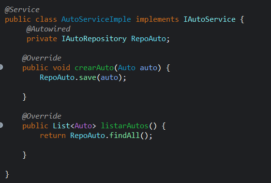
+ Esta clase es la que ejecuta el trabajo real y cumple con el contrato(titulos,metodos) definido en la interfaz (mediante **implements IAutoService**).
+ **@Service:** Se utiliza esta anotación para indicarle a Spring Boot que esta clase pertenece a la capa de lógica de negocio.
+ **@Autowired:** Permite inyectar (conectar) el repositorio **IAutoRepository** que creamos en el paso anterior. De esta forma, el servicio puede acceder a la base de datos.
+ **@Override:** Indica que se están implementando los métodos de la interfaz.
  + En **crearAuto**, delega la tarea al repositorio usando el método **RepoAuto.save(auto)** para guardar el dato en la base de datos.
  + En **listarAutos**, utiliza **RepoAuto.findAll()** para buscar y retornar todos los autos almacenados en la tabla.
---
# 9. Creacion del controlador
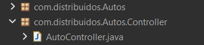

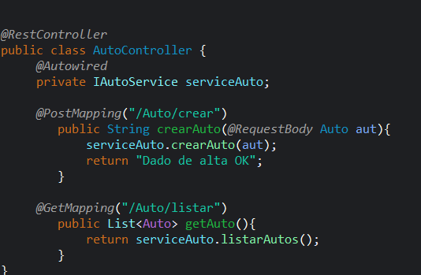
#### El controlador es el punto de entrada de las peticiones web de nuestra aplicación.la configuración se realiza de la siguiente manera:
+ **Ubicación del archivo:** Dentro del paquete com.distribuidos.Autos
Controller, se crea la clase **AutoController.java**
+ **@RestController:** Esta anotación en la cabecera de la clase indica
que manejará solicitudes HTTP y devolverá las respuestas directamente al
cliente (generalmente en formato JSON).
+ **@Autowired:** Se utiliza para inyectar nuestra interfaz IAutoService
en la variable serviceAuto, permitiendo que el controlador acceda a la
lógica de negocio.
+ **Crear un Auto (POST):** Se utiliza **@PostMapping("/Auto/crear")**
para definir la ruta que recibe solicitudes HTTP POST. La anotación
**@RequestBody** toma los datos enviados (por ejemplo, cuando ejecutas
y verificas el **endpoint desde Postman**) y los convierte en un
objeto Auto. Luego invoca al servicio para guardarlo y retorna el
mensaje "Dado de alta OK".
+ **Listar Autos (GET):** Mediante **@GetMapping("/Auto/listar")**, se expone un **endpoint** para solicitudes HTTP GET. Este método llama a **serviceAuto.listarAutos()** para recuperar y devolver la lista completa de los vehículos almacenados.
---

# 9 Configuración del Archivo application.properties

```
Para que el microservicio logre conectarse a la base de datos y ejecutarse en el puerto especificado, debe ingresar al archivo ubicado en la siguiente ruta. Recordar tener instalado y corriendo xampp:
Autos/src/main/resources/application.properties
```
Dentro de dicho archivo, incorpore las siguientes líneas de configuración:

```plaintext
server.port = 9001
spring.jpa.hibernate.ddl-auto=update
spring.datasource.url=jdbc:mysql://localhost:3306/servicio_Auto?serverTimezone=UTC
spring.datasource.username=root
spring.datasource.password=
```
---
# 10 Verificacion en Postman
#### Para asegurar el correcto funcionamiento, puedes utilizar Postman para conectarte al microservicio de Spring Boot y ejecutar los endpoints HTTP POST y GET.
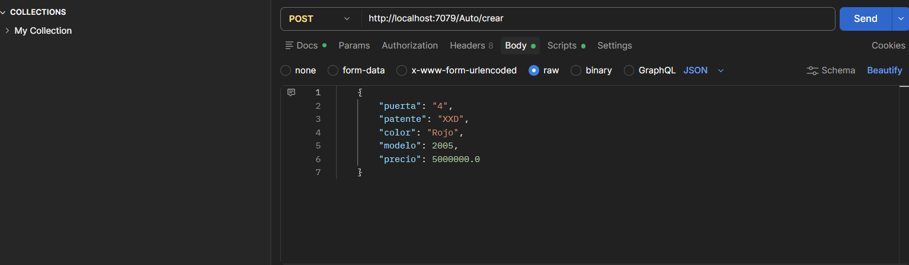
+ **Petición POST (Crear):** En la primera captura, se configura una 
solicitud de tipo POST dirigida a la ruta http://localhost:7079/Auto/crear. En la sección Body, seleccionando la opción raw y formato JSON, se
escriben y envían los atributos del vehículo (como puerta, patente, color,
modelo y precio) para guardarlo en la base de datos.

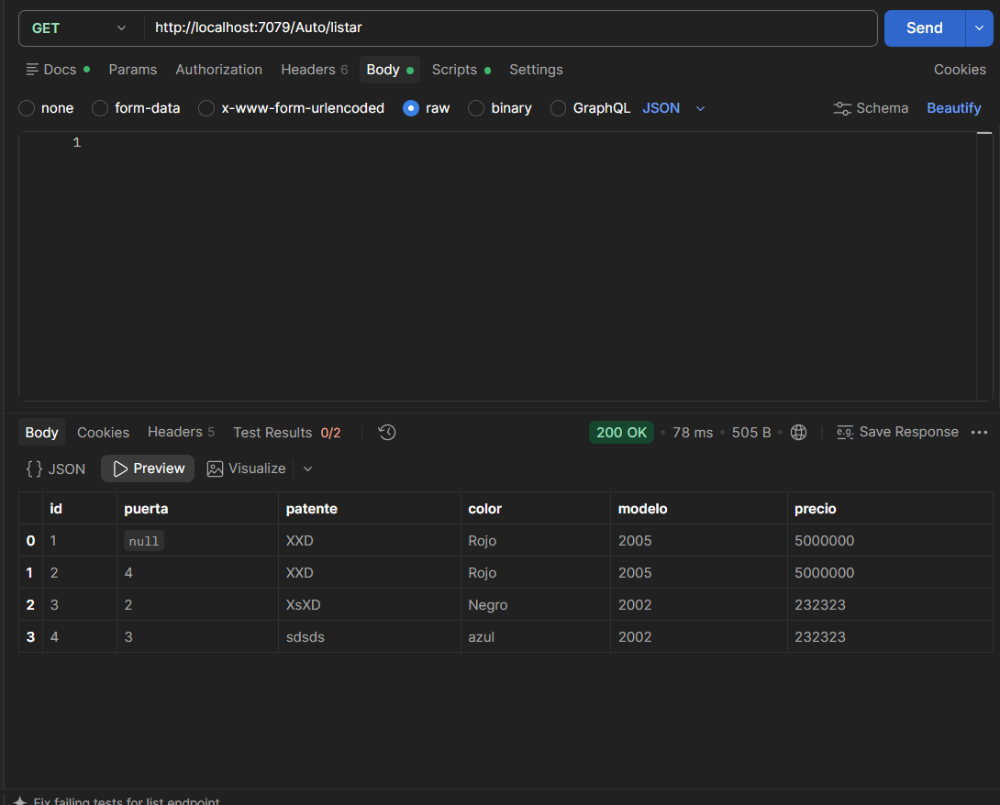
+ **Petición GET (Listar):** En la segunda captura, se ejecuta una solicitud de tipo GET hacia la ruta http://localhost:7079/Auto/listar. muestra
en un formato de tabla todos los autos que han sido registrados
exitosamente en el sistema. 
---
